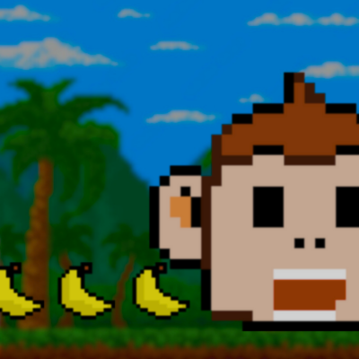
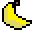
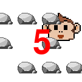
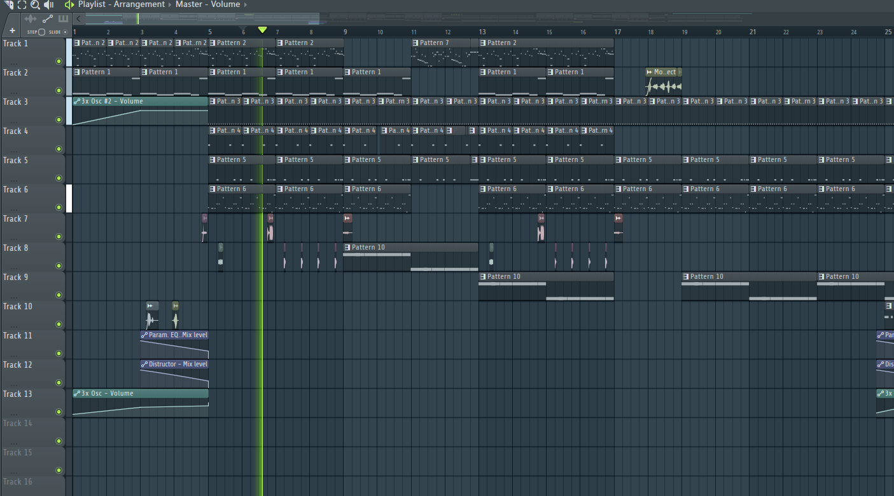
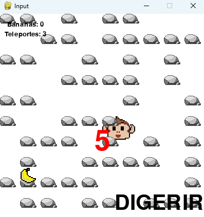

## Monkey Munch Madness

Este é um jogo simples de plataforma 2D desenvolvido com Pygame, onde você controla um macaco faminto que precisa comer bananas para sobreviver! 

### Instalação

1. **Baixe o código:** Baixe este repositório ou clone-o usando `git clone https://github.com/tavares-fiap/monkey-munch-madness`.
2. **Instale o Pygame:** Se ainda não tiver, instale o Pygame usando `pip install pygame`.
3. **Execute o Jogo:** Execute o arquivo `jogo.py` .

### Como Jogar

* **Movimentação:** Use as teclas WASD ou as setas do teclado para controlar o macaco.
* **Coma Bananas:** Colete bananas para ganhar pontos e crescer!

* **Aumento de Tamanho:** A cada 5 bananas comidas, o macaco aumenta de tamanho.
* **Digerir (C):** Diminui o macaco para o tamanho original para evitar que fique preso entre as pedras. Possui um cooldown de 300 frames.

* **Teletransporte (X):** Teleporta o macaco para a posição do mouse. Você começa com 3 teletransportes e pode coletar mais ao encontrar elementos de teleporte no mapa. 

* **Labirinto:** O labirinto é gerado aleatoriamente a cada partida, desafiando você a encontrar as bananas e evitar as pedras. 
* **Wrap Around:** O mapa é contínuo, permitindo que o macaco saia de um lado da tela e reapareça no outro.
* **Contador:**  Se você não comer bananas por muito tempo, um contador aparecerá na tela.  Ao chegar a zero, você perde! 

### Controles

* **W/A/S/D ou Setas:**  Movimentação
* **X:** Teletransporte
* **C:** Digerir
* **Esc:** Sair do jogo

### Recursos

* **Gráficos:**
    * `data/img/`: Contém as imagens do jogo, como o macaco, banana, pedras, teleporte, etc. **Todas as imagens foram criadas em pixel art pelo grupo!**
* **Sons:**
    * `data/sounds/`: Contém os efeitos sonoros do jogo, como som de mordida, teletransporte, etc.
* **Música:**
    * `data/sounds/`: Contém a música de fundo do jogo. **A música tema foi composta pelo grupo no FL Studio!**

### Desafios Cumpridos

* **Arquivo README:** Este arquivo README!
* **Pedras:**  
    * As pedras são desenhadas como Sprites de Pedras.
    * O jogador não consegue passar pelas pedras.
    * O jogo suporta múltiplas pedras, formando um labirinto.

* **Labirinto:** 
    * Um labirinto foi desenhado manualmente, utilizando várias pedras.
    * O jogo também possui funcionalidade para gerar labirintos aleatórios, tornando a experiência mais desafiadora e divertida.
* **Pontuação:**
    * A contagem de pontos (bananas comidas) é exibida no console (CMD do Windows).
    * A pontuação também é exibida na tela do jogo.
* **Crescimento do Jogador:**  
    * O jogador aumenta de tamanho quando ele come uma banana.
* **Wrap Around:**
    * O jogador que sai da tela pela esquerda reaparece do lado direito, e vice-versa.
    * O mesmo comportamento se aplica aos limites superior e inferior da tela. 

### Feedback

Sua opinião é importante! Se você tiver algum feedback, sugestões ou problemas com o jogo, por favor, abra uma issue neste repositorio.

**Divirta-se jogando Monkey Munch Madness!**

## Autor

- [Pedro Tavares](https://www.linkedin.com/in/pedro-tavares-7ab626297)

